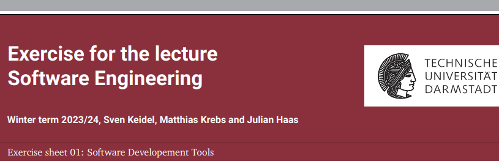

**Hand in format:** Hand in your solution for the bonus tasks via Moodle. For non-code related bonus tasks, use a
**single PDF file**. For code related bonus tasks, hand in a zip file (no other archive format) containing the complete
and compilable project including your local repository. You can update your solution arbitrarily often until the
submission deadline. We grade the submission uploaded last.

**Hint:** All members of an exercise group should be able to view and edit the same submission.

**Attention:** This exercise sheet contains 7 bonus tasks.

**Submission deadline:** 03.11.2023, 10:00

**Discussion in the small groups:** Week starting with 06.11.2023

**Publishing date of a solution:** 08.11.2023

The goal of this exercise sheet is to learn Scala and its development tools. First, have a look at the overview[^1]
about the differences between Java and Scala. Then, choose an IDE of your liking and set it up to be used with Scala.
We recommend to use IntelliJ[^2].

---

#### Task 1: SBT (1 Point)

---

Using your chosen IDE, create a Scala 3 project based on the Simple Build Tool (SBT)[^3] You can, as an alternative,
use the Scala 3 Giter8 Template[^4] to create the project via SBT on the command line.

Use “arithmetic” as the name for the project.

---

#### Task 2: Git (1 Point)

---

1. Create a git[^5] repository inside your project directory from Task 1 using `git-init`[^6].

**Hint:** You may consider hosting your repository using the [TU-GitLab](https://www.hrz.tu-darmstadt.de/services/it_services/gitlab/index.de.jsp).

2. Initialize your newly created repository by adding a `.gitignore` file suitable for your chosen IDE and SBT to the
   index using `git-add`[^7].

**Hint:** You may use the [suggested .gitignore](https://git.rwth-aachen.de/se_ws23/exercise01/-/blob/5d418dfeb0050ca8162bf504125dfd60cb9615cc/intellij_sbt_gitignore).

3. Add the Scala project files to the index and commit the changes to your local repository using `git commit`[^8] with
   a suitable commit message. Prefix your commit message with “init: ”.

---

#### Task 3: Arithmetic expressions (2 Points)

---

In this task, we create the structures to model arithmetic expressions.

1. Create an `enum`[^9] “ArithmeticExpression” within the `package` “arithmetic”.

You must support at least the
expressions shown in the following table.

| **Name** | **Use**        | **#Operands** | **Attribute type**   | **Example** |
|----------|----------------|---------------|----------------------|-------------|
| Num      | Whole numbers  | 1             | Int                  | 42          |
| Minus    | Negative       | 1             | ArithmeticExpression | -42         |
| Plus     | Addition       | 2             | ArithmeticExpression | 2 + 4       |
| Mult     | Multiplication | 2             | ArithmeticExpression | 2 * 4       |
| Div      | Division       | 2             | ArithmeticExpression | 2 / 4       |

2. Commit the changes to your local repository. Prefix your commit message with “structure: ”.

---

#### Task 4: Testing/SBT (1 Point)

---

Add ScalaTest[^10] to your SBT project and commit the changes using the commit message “ScalaTest”.

**Hint:**

In ScalaTest it is possible to write tests using many different styles[^11]. The style “FunSuite” is similar to the
Unit tests known from Java.

---

#### Task 5: Pattern matching (3 Points)

---

1. Create a companion object[^12] for your enum introduced in Task 3.
2. To be able to yield a value from an arithmetic expression add a method

&nbsp;&nbsp;&nbsp;&nbsp;&nbsp;&nbsp;&nbsp;&nbsp;&nbsp;&nbsp;
&nbsp;&nbsp;&nbsp;&nbsp;&nbsp;&nbsp;&nbsp;&nbsp;&nbsp;&nbsp;
&nbsp;&nbsp;&nbsp;&nbsp;&nbsp;&nbsp;&nbsp;&nbsp;&nbsp;&nbsp;
`def evaluate(expression: ArithmeticExpression): Double = ???`

to the companion object and implement it.

3. Arithmetic expressions should have a way to bring them into a better readable format. Add a method

&nbsp;&nbsp;&nbsp;&nbsp;&nbsp;&nbsp;&nbsp;&nbsp;&nbsp;&nbsp;
&nbsp;&nbsp;&nbsp;&nbsp;&nbsp;&nbsp;&nbsp;&nbsp;&nbsp;&nbsp;
&nbsp;&nbsp;&nbsp;&nbsp;&nbsp;&nbsp;&nbsp;&nbsp;&nbsp;&nbsp;
`def pretty(expression: ArithmeticExpression): String = ???`

to the companion object and implement it. The pretty method should bring the given arithmetic expression into a
human-readable format in infix notation.

**Hint:** You can use string interpolation[^13] to construct the formatted strings.

4. Add at least one test per method for `evaluate` and `pretty`, to check the correct behavior of the methods.

**Hint:** You can compare `Double` and `String` values in your assertions using `actual == expected`. Keep in mind, that
it is usually not advisable to compare floating point values using strict equality. You may consider using Scalactic[^14].

5. Commit the changes to your local repository. Prefix your commit message with “functionality: ”.

**Hint:** Implement the methods evaluate and pretty using pattern matching[^15] and recursion.

---

#### Task 6: Adding a case (3 Points)

---

In this task we want to add support for a new kind of arithmetic expression.

1. Add at least the following new case to your `enum` from Task 3.

| **Name** | **Use**        | **#Operands** | **Attribute type**   | **Example**   |
|----------|----------------|---------------|----------------------|---------------|
| Pow      | Exponentiation | 2             | ArithmeticExpression | 24 |

2. Make sure that your code compiles without any warnings after adding the new case by updating all affected methods.
For simplicity, we assume exponents evaluate to whole numbers, and you can use `doubleValue.toInt` to convert a double
to an integer value.

**Hint:** You may use the facts that xy = x·xy-1 for y > 0 and xy =
(1/x)·xy+1 for y < 0 in your recursive calls using pattern guards[^16].

3. Add at least one test per method `pretty` and `evaluate` to check the behavior of the added case.
4. Commit the changes to your local repository. Prefix the commit message with “pow: ”.

---

#### Task 7: Higher-order functions (3 Points)

---

In this task we want to extend the already implemented functionality to be applicable to multiple arithmetic expressions.

1. Add the following method to the companion object introduced in Task 5:
   
&nbsp;&nbsp;&nbsp;&nbsp;&nbsp;&nbsp;&nbsp;&nbsp;&nbsp;&nbsp;
&nbsp;&nbsp;&nbsp;&nbsp;&nbsp;&nbsp;&nbsp;&nbsp;&nbsp;&nbsp;
&nbsp;&nbsp;&nbsp;&nbsp;&nbsp;&nbsp;&nbsp;&nbsp;&nbsp;&nbsp;
`def evaluate(expressions: List[ArithmeticExpression]): List[Double] = ???`

Implement this method, s.t. it returns the evaluations of each expression from the given list.

**Hint:** Scala provides many built-in operations on collections[^17][^18]

2. Add the following method to the companion object introduced in Task 5:

&nbsp;&nbsp;&nbsp;&nbsp;&nbsp;&nbsp;&nbsp;&nbsp;&nbsp;&nbsp;
&nbsp;&nbsp;&nbsp;&nbsp;&nbsp;&nbsp;&nbsp;&nbsp;&nbsp;&nbsp;
&nbsp;&nbsp;&nbsp;&nbsp;&nbsp;&nbsp;&nbsp;&nbsp;&nbsp;&nbsp;
`def showResults(expressions: List[ArithmeticExpression]): String = ???`

Implement this method, s.t. it returns the given arithmetic expressions in a human-readable format in infix notation.
The result must have one “expression = value” pair per line and maintain the order of the given expressions. The result
must not end with a newline (\n).

**Hint:** You may want to preprocess the data s.t. you get tuples of readable expressions and evaluated values, before
constructing the result string.

3. Add at least one test per method `evaluate` and `showResults` to check the behavior of the methods.
4. Commit your changes to your local repository. Prefix the commit message with “lists: ”.

[^1]: https://docs.scala-lang.org/scala3/book/scala-for-java-devs.html
[^2]: https://docs.scala-lang.org/getting-started/intellij-track/getting-started-with-scala-in-intellij.html
[^3]: https://www.scala-sbt.org/
[^4]: https://github.com/scala/scala3.g8
[^5]: https://git-scm.com/
[^6]: https://git-scm.com/docs/git-init
[^7]: https://git-scm.com/docs/git-add
[^8]: https://git-scm.com/docs/git-commit
[^9]: https://docs.scala-lang.org/scala3/book/types-adts-gadts.html#algebraic-datatypes-adts
[^10]: https://www.scalatest.org/user_guide
[^11]: https://www.scalatest.org/user_guide/selecting_a_style
[^12]: https://docs.scala-lang.org/overviews/scala-book/companion-objects.html
[^13]: https://docs.scala-lang.org/scala3/book/string-interpolation.html
[^14]: https://www.scalactic.org/
[^15]: https://docs.scala-lang.org/tour/pattern-matching.html
[^16]: https://docs.scala-lang.org/tour/pattern-matching.html#pattern-guards
[^17]: https://scala-lang.org/api/3.x/scala/collection/immutable/List.html
[^18]: https://docs.scala-lang.org/scala3/book/collections-methods.html
